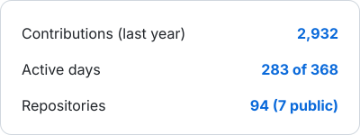

### Georgii Morozov

**Senior AI Engineer at Raiffeisen Bank International.** Seven years in engineering, the last four on LLM systems. I own the path from agent logic and retrieval down to what a token costs on the GPU it runs on.

#### What I work on

- **Agentic systems** — LangGraph flows, tool use and MCP, structured outputs, routing between models, human-in-the-loop and escalation paths.
- **Retrieval** — hybrid lexical and vector search, rerankers, and golden sets to tell whether a retrieval change actually helped.
- **Evaluation** — deterministic scorers, LLM-as-a-judge, regression runs pinned by config hash, so prompt changes stop being guesswork.
- **Inference** — self-hosted vLLM and SGLang, GPU memory budgeting, KV-cache offloading, prefill/decode disaggregation, quantization picked to fit the node.

#### Open source

**[sglang-dsv4-pd-hicache-fixes](https://github.com/gmoroz/sglang-dsv4-pd-hicache-fixes)** — engine-level fixes for DeepSeek-V4 prefill/decode disaggregation on SGLang `v0.5.16`. Per-pool HiCache metrics that make a saturated SWA pool visible instead of hiding it behind FULL pool numbers; coordinated FULL/SWA host eviction so a radix node does not lose one copy and keep the useless other; host allocation diagnostics with rollback; and a deterministic guard that ends a request once its output collapses into a repeating tail.

#### Stack

Python · FastAPI · asyncio · PostgreSQL · pgvector · Elasticsearch · Redis 
vLLM · SGLang · LangGraph · Hugging Face Transformers · PyTorch 
Docker · Kubernetes · AWS · Azure · Prometheus · Grafana · OpenTelemetry

<picture>
  <source media="(prefers-color-scheme: dark)" srcset="assets/stats-dark.svg">
  
</picture>

[LinkedIn](https://linkedin.com/in/georgii-morozov-ai-ml-nlp) · Yerevan, Armenia
